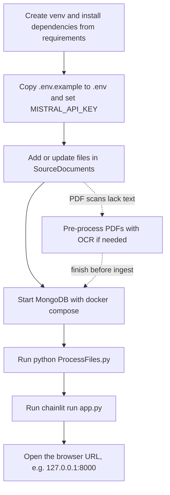

# Giulia (version 1)

## A deliverable of the SOILL-Stepup project

Giulia is a prototype **R**etrieval-**A**ugmented-**G**eneration chatbot.
Source files from `SourceDocuments/` are chunked and stored in MongoDB. Vectors from the text are indexed in FAISS, and responses are generated through the Mistral API with source references.

**SPDX-Licence-Identifier:** [CC-BY-4.0](LICENSE) (Attribution 4.0 International).

## Prerequisites

- Python 3.9+ (3.10+ recommended)
- Docker (for the local MongoDB service)
- A Mistral API key

## Credits

Professor Stephen Hallett, Cranfield University, 2026.

## Initial one-time setup

Run the stages below once only.

```bash
cd "…/Giulia Chatbot v1"
python3 -m venv .venv
source .venv/bin/activate
pip install -r requirements.txt
cp .env.example .env
# edit .env: set MISTRAL_API_KEY and, if required, MONGODB_URI
```

## Run order (every session)

The first two boxes in this flow are one-time actions. Later sessions usually
start at “Add or update source files”. A dotted link marks an **optional** branch:
pre-process image-only PDFs with OCR (then place the resulting files in
`SourceDocuments/`) **before** running `ProcessFiles.py` — see
[OCR_PDF_PreProcessingWorkflow.md](OCR_PDF_PreProcessingWorkflow.md).



1. **Start MongoDB**:

   ```bash
   cd mongodb_docker
   docker compose up -d
   ```

2. **Ingest or update source files** (`.pdf`, `.docx`, `.txt`) from
   `SourceDocuments/`:

   ```bash
   source .venv/bin/activate
   python ProcessFiles.py
   ```

   - New/changed files are re-embedded.
   - Removed files have their chunks deleted.
   - Unchanged files are skipped.
   - FAISS is rebuilt only when there are content changes.

3. **Start the Chainlit app**:

   ```bash
   source .venv/bin/activate
   chainlit run app.py
   ```

## Environment variables (`.env`)

| Variable | Description |
|----------|-------------|
| `MISTRAL_API_KEY` | Required for ingestion and chat. |
| `MONGODB_URI` | Default: `mongodb://127.0.0.1:27017/giulia` (must include the database name). |
| `MISTRAL_EMBED_MODEL` | Embedding model, default `mistral-embed`. |
| `MISTRAL_CHAT_MODEL` | Chat model, e.g. `mistral-small-latest`. |
| `RAG_TOP_K` | Number of chunks retrieved per question (default `8`). |

## Preview mode (`--dry-run`)

Review changes before embedding or writing anything and reports to the terminal:

```bash
python ProcessFiles.py --dry-run
```

Dry-run reports what would be ingested or removed, but does not call Mistral,
does not write MongoDB, does not update the manifest, and does not rebuild FAISS.

## OCR pre-processing for scanned PDFs

If PDFs are image-heavy (no selectable text, but images contain text), run OCR first and only move
approved OCR outputs into `SourceDocuments/`.

See [OCR_PDF_PreProcessingWorkflow.md](OCR_PDF_PreProcessingWorkflow.md) for the
full incoming → OCR output → promotion workflow.

## Smoke test

1. Place one test file (`.pdf`, `.docx`, or `.txt`) in `SourceDocuments/`.
2. Run `python ProcessFiles.py` and confirm ingest output on stderr. ProcessFiles.py can be run multiple times - it handles changes made to the source files (additions, edits, removals).
3. Run the same command again without changing files; confirm the “no changed source files” message.
4. Start Chainlit and ask a question whose answer is in that file.

## Project layout

| Path | Purpose |
|------|---------|
| `SourceDocuments/` | Source files for indexing (`.pdf`, `.docx`, `.txt`) |
| `data/manifest.json` | Per-file hashes used for incremental re-runs |
| `data/faiss/` | FAISS index and metadata |
| `ProcessFiles.py` | Ingestion and incremental re-index logic |
| `app.py` | Chainlit entrypoint |
| `giulia/` | Shared extraction, chunking, storage, and RAG logic |
| `mongodb_docker/` | Docker Compose files for local MongoDB |
| `PDFPreProcessing/` | OCR batch scripts and workflow staging folders |

## Notes

- Giulia uses the Mistral AI for both embeddings and chat.
- Answers include source references with location ranges (pages, lines, or paragraphs).
- Scanned PDFs (may) need OCR before ingestion. Optional OCR tools are included in this repo.

---

Last updated: 25-04-2026 (UK style).
