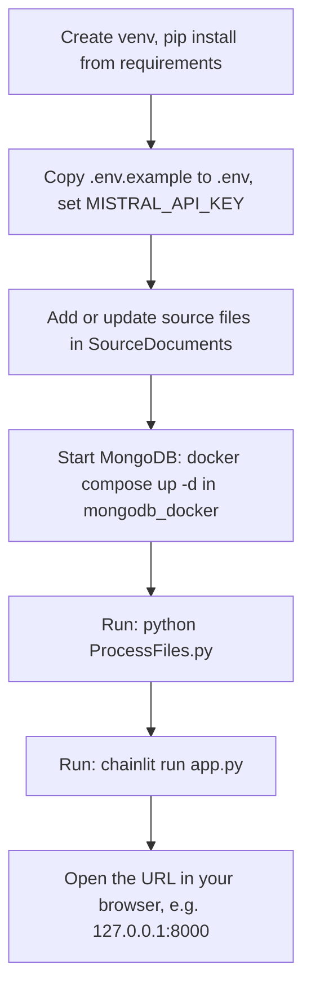

# Giulia (version 1)

## A deliverable of the SOILL-Stepup project

A prototype **R**etrieval-**A**ugmented-**G**eneration chatbot: source files in
`SourceDocuments/`, text chunks in **MongoDB** (local Docker), vectors in
**FAISS**, and answers + sources via the **Mistral API** (the same model family
as the Le Chat product, accessible programmatically from [La
Plateforme](https://console.mistral.ai/)).

**SPDX-Licence-Identifier:** [CC-BY-4.0](LICENSE) (Attribution 4.0
International; see `LICENSE`).

## Prerequisites

- Python 3.9+ (3.10+ recommended)
- Docker, for the local MongoDB container
- A Mistral API key

## Credits

Professor Stephen Hallett, Cranfield University, 2026


## One-time setup

```bash
cd "…/Giulia Chatbot v1"
python3 -m venv .venv
source .venv/bin/activate
pip install -r requirements.txt
cp .env.example .env
# edit .env: set MISTRAL_API_KEY and, if required, MONGODB_URI
```

## Run order (every session)

The first two steps in the flowchart are **one-time** (environment and secrets). All later
runs: start from **add or change source files** (only if needed), then **MongoDB** →
**`ProcessFiles.py`** → **Chainlit**.



1. **Start MongoDB** (one terminal):

   ```bash
   cd mongodb_docker
   docker compose up -d
   ```

2. **Ingest or update source files** (`.pdf`, `.docx`, `.txt`) after you add or change files under
   `SourceDocuments/`):

   ```bash
   source .venv/bin/activate
   python ProcessFiles.py
   ```

   - First run, or when files are added/changed/removed, the script re-embeds
     only what is **new** or **changed** (per-file SHA-256), removes chunks for
     **deleted** source files, and rebuilds the FAISS index from the stored embeddings.
   - No API call for **unchanged** files.

3. **Start the chat UI**:

   ```bash
   source .venv/bin/activate
   chainlit run app.py
   ```

   Open the URL shown in the terminal (usually `http://127.0.0.1:8000`).

## Environment variables (`.env`)

| Variable | Description |
|----------|-------------|
| `MISTRAL_API_KEY` | Required for ingestion and chat. |
| `MONGODB_URI` | Default: `mongodb://127.0.0.1:27017/giulia` (must include database name). |
| `MISTRAL_EMBED_MODEL` | Default: `mistral-embed`. |
| `MISTRAL_CHAT_MODEL` | e.g. `mistral-small-latest` or `mistral-large-latest`. |
| `RAG_TOP_K` | Number of chunks to retrieve (default: `8`). |

## `ProcessFiles.py` without applying changes

List what would be ingested or removed (no MongoDB or Mistral calls):

```bash
python ProcessFiles.py --dry-run
```

## Smoke test (quick)

1. Copy a small source file (`.pdf`, `.docx`, or `.txt`) into `SourceDocuments/`.
2. Start Mongo, run `python ProcessFiles.py` (expect "Ingested" and "FAISS index
   rebuilt" on stderr).
3. Run `python ProcessFiles.py` again with **no** changes to the file: expect
   *No new, changed, or removed source files*.
4. Start `chainlit run app.py` and ask a question whose answer is only in that
   document; check the **Sources (retrieved)** list at the end of the reply.

## Layout

| Path | Purpose |
|------|---------|
| `SourceDocuments/` | Input `.pdf`, `.docx`, and `.txt` files (scanned subfolders are supported) |
| `data/manifest.json` | Per-file hashes for incremental re-runs (created by the script) |
| `data/faiss/` | FAISS index and `meta.json` (order of `chunk_id`s) |
| `ProcessFiles.py` | Ingestion and index rebuild |
| `app.py` | Chainlit RAG web UI |
| `giulia/` | Shared code (chunking, PDF text, MongoDB, FAISS, RAG) |
| `mongodb_docker/` | `docker compose` for local MongoDB |

## Notes

- The chat uses **Mistral only** (embeddings + chat). No other LLM vendors are
  called from this app.
- Giulia answers with a **source list** (file name and location range: pages, lines, or paragraphs) derived from the retrieved chunks.
- Image-only (scanned) PDFs with no text layer are not read without OCR; that
  is out of scope for this prototype.

---

Last updated: 24-04-2026 (UK style).
